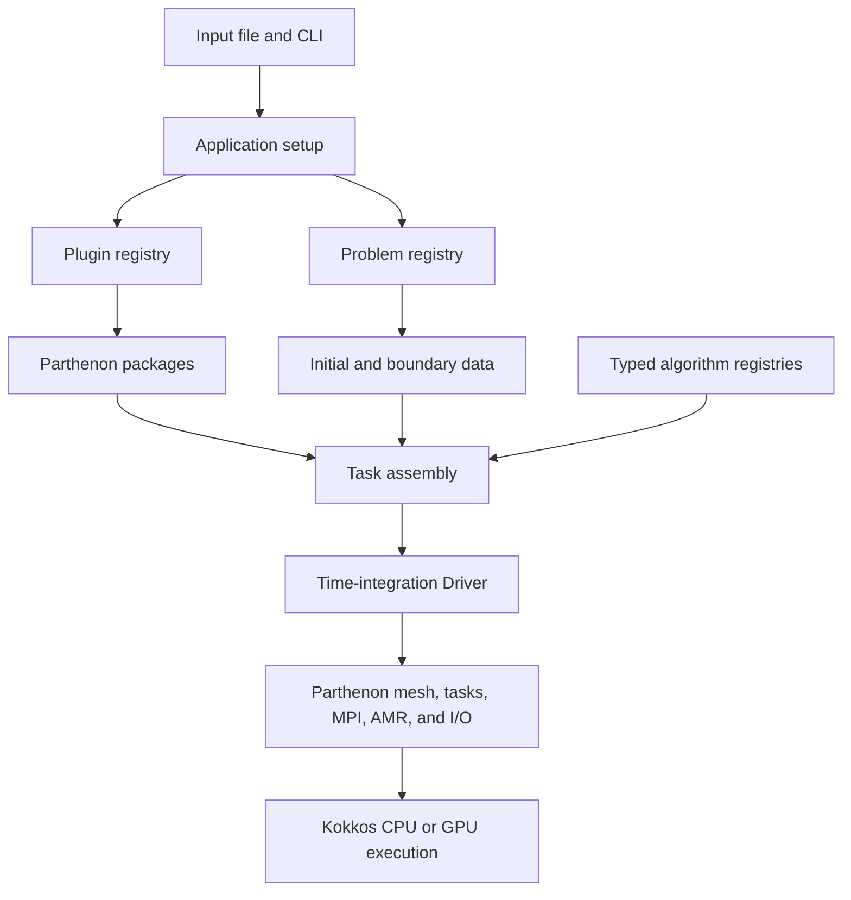

# PANGU

**Parthenon-Based Astrophysics for Numerical Relativity and General-Relativistic Magnetohydrodynamics in a Unified Framework**

## 1. Introduction

PANGU is a modular C++20 framework for high-performance simulations of
astrophysical fluids and dynamical spacetimes. It supports Newtonian
hydrodynamics and magnetohydrodynamics, special- and general-relativistic
flows, fixed-background GRMHD, and coupled GRMHD–Z4c evolution within a
common finite-volume framework.

PANGU uses [Parthenon](https://github.com/parthenon-hpc-lab/parthenon) for
mesh management, task scheduling, MPI communication, adaptive mesh
refinement, HDF5 output, and restart support. Its numerical kernels use
Kokkos for portable execution on CPUs and GPUs. Reconstruction methods,
Riemann solvers, equations of state, and timestep estimators are selected
through typed compile-time registries, while optional physics is integrated
through a versioned plugin system with explicit dependencies and conflicts.

The built-in plugins provide electron thermodynamics and heating, radiation
cooling, radiation transport, diffusion, Ohmic resistivity, and viscosity.
External source plugins use the same interface and can be added through
`PANGU_PLUGIN_PATHS` without modifying PANGU's Driver or package registry.

> [!IMPORTANT]
> PANGU is research software under active development. Production studies
> should record the Git revision, build configuration, input file, plugin
> set, and dependency versions, and should run the validation suite relevant
> to the selected physics configuration.

## 2. System Requirements

PANGU builds from source with CMake and a C++20 compiler. Parthenon and its
bundled Kokkos dependency are included as Git submodules, so a normal source
checkout does not require a separate Parthenon or Kokkos installation.

| Component | Requirement | Purpose |
|---|---|---|
| CMake | 3.20 or newer | Configure PANGU, Parthenon, and plugins |
| C++ compiler | C++20 support | Build host code and numerical kernels |
| Git | Submodule support | Obtain Parthenon and its bundled dependencies |
| OpenMPI | 5.0.10 recommended; required by default | Distributed-memory execution |
| Parallel HDF5 | 1.14.3 recommended; required by default | Parallel output and restart files |
| Python 3 | Required when tests are enabled | Smoke tests and regression drivers |

The recommended and currently validated configuration is **OpenMPI 5.0.10**
with **Parallel HDF5 1.14.3**. Parallel HDF5 must be built with the compiler
wrappers from the same OpenMPI installation used to compile PANGU. This
avoids mixing incompatible MPI implementations in the executable and the
HDF5 library.

When MPI and HDF5 are enabled together, PANGU rejects a serial HDF5
installation. Parallel HDF5 1.10.7 or newer is required when compression is
enabled; version 1.14.3 is the recommended configuration. A serial build can
disable both dependencies with `PANGU_ENABLE_MPI=OFF` and
`PANGU_ENABLE_HDF5=OFF`.

Kokkos provides the execution backend. PANGU currently exposes three common
configurations:

- **Serial CPU:** selected when neither OpenMP nor CUDA is enabled.
- **OpenMP CPU:** enabled with `PANGU_ENABLE_OPENMP=ON` and a compiler with
  OpenMP support.
- **NVIDIA GPU:** enabled with `PANGU_ENABLE_CUDA=ON`; this requires a CUDA
  toolkit and a host compiler supported by that toolkit.

The optional TwoPuncturesC initial-data generator is available only for the
Z4c synchronized-spacetime configuration. It requires a prebuilt
TwoPuncturesC installation and GSL, supplied through
`PANGU_TWOPUNCTURES_ROOT` when `PANGU_ENABLE_TWOPUNCTURES=ON`.

PANGU does not support in-source builds. Configuration and build artifacts
must be placed in a separate directory such as `build-serial` or
`build-cuda`.

## 3. Obtaining the Source

Clone the repository together with all required submodules:

```bash
git clone --recurse-submodules https://github.com/adamdarx/PANGU.git
cd PANGU
```

If the repository was cloned without `--recurse-submodules`, initialize and
update the dependencies before configuring PANGU:

```bash
git submodule update --init --recursive
```

The `parthenon/` directory is a pinned Git submodule. Keep it at the commit
recorded by the selected PANGU revision unless a PANGU update explicitly
changes that reference. After switching branches or commits, run
`git submodule update --init --recursive` again to synchronize the source
tree.

Build artifacts must remain in a dedicated out-of-source directory. For
example, use `cmake -S . -B build-serial` rather than running CMake directly
in the repository root. Built-in plugins are already present under `plugins/`;
external plugins may remain in separate repositories and are supplied at
configuration time through `PANGU_PLUGIN_PATHS`.

## 4. Architecture Overview

PANGU separates reusable infrastructure, physical systems, numerical
algorithms, and optional physics. This keeps the Driver independent of
specific plugins and allows algorithms to be selected without adding
name-based branches to the time-integration loop.



The main architectural layers are:

- **Application setup:** parses the CLI and input file, checks the selected
  problem against the compiled physics configuration, resolves plugins, and
  constructs the active Parthenon packages.
- **Physical systems:** HD, MHD, relativistic fluid dynamics, and Z4c own
  their state variables and contribute flux, source, conversion, boundary,
  and diagnostic operations through typed task contracts.
- **Numerical registries:** reconstruction methods, Riemann solvers, EOS
  implementations, and timestep estimators are selected through compact
  compile-time registries. Their concrete types remain visible inside
  Kokkos kernels and do not require device-side virtual dispatch.
- **Task assembly and Driver:** combine contributions into a Parthenon task
  graph for each integration stage. The Driver coordinates evolution but
  does not identify individual physics plugins by name.
- **Plugin system:** discovers built-in and external source plugins during
  CMake configuration. At startup it resolves requested plugins, versioned
  dependencies, capabilities, conflicts, and initialization order before
  adding their packages and numerical contributions.
- **Problem generators:** provide initial and boundary data for documented
  physical problems. They remain part of PANGU rather than being bundled
  into physics plugins.

The repository follows the same separation:

| Path | Responsibility |
|---|---|
| `src/app/` | CLI, input validation, package setup, and problem selection |
| `src/driver/` | Stage context, task assembly, and time integration |
| `src/hydro/`, `src/mhd/`, `src/relativity/`, `src/z4c/` | Physical systems and their task contributions |
| `src/eos/`, `src/reconstruct/`, `src/riemann/`, `src/estimator/` | Typed numerical algorithms and registries |
| `src/pangu/plugin_api/` | Versioned public interfaces available to plugins |
| `src/plugin/` | Plugin discovery results and runtime dependency resolution |
| `src/pgen/` | Problem generators and boundary setup |
| `plugins/` | Built-in plugins, each with its own manifest and implementation |
| `input/` | Versioned example and validation input files |
| `tst/` | Unit, smoke, regression, and cross-code validation tests |

## 5. Quick Start

This section builds a CPU version of PANGU with the recommended OpenMPI and
Parallel HDF5 stack, validates an input file, and runs a single short
simulation. All commands are executed from the PANGU repository root unless
stated otherwise.

### 5.1 Check or install the required dependencies

PANGU provides an interactive command-line setup program based on the
project's validated dependency build procedure. It first checks environment
variables and `PATH` for CUDA, OpenMPI, and Parallel HDF5, then lets the user
install any missing component:

```bash
./scripts/shell/setup_dependencies.sh
```

The menu installs CUDA 12.8.1, CUDA-aware OpenMPI 5.0.10, and Parallel HDF5
1.14.3. CUDA is installed as a toolkit only; the script does not install or
replace the NVIDIA driver. The CUDA step requires `sudo`, while OpenMPI and
HDF5 default to `${HOME}/.local/pangu-deps`. Installation paths can be
changed before running the program:

```bash
export PANGU_DEPS_ROOT=/path/to/pangu-dependencies
export PANGU_CUDA_ROOT=/usr/local/cuda-12.8
./scripts/shell/setup_dependencies.sh
```

For a non-interactive status report, run:

```bash
./scripts/shell/setup_dependencies.sh --check
```

After installation, source the environment file reported by the program.
With the default prefix, use:

```bash
source "${HOME}/.local/pangu-deps/pangu-env.sh"
```

Parallel HDF5 must have been built with the compiler wrappers from the same
OpenMPI installation used by PANGU. Check the actual installation directly:

```bash
"${PANGU_OPENMPI_ROOT}/bin/mpirun" --version
"${PANGU_HDF5_ROOT}/bin/h5pcc" -showconfig | \
  grep -E 'HDF5 Version:|C Compiler:|Parallel HDF5:|Parallel Filtered Dataset Writes:'
"${PANGU_HDF5_ROOT}/bin/h5pcc" -show
```

The report must contain `Parallel HDF5: yes`. The compiler shown by `h5pcc`
must resolve to `mpicc` from the selected OpenMPI installation. Do not use a
serial HDF5 installation or an HDF5 library compiled against a different MPI
implementation.

### 5.2 Initialize the source tree

Ensure that Parthenon, Kokkos, and all nested dependencies are available:

```bash
git submodule update --init --recursive
```

Do not configure PANGU until this command completes successfully.

### 5.3 Configure a CPU build

The following configuration builds the special-relativistic assembly with
MPI, Parallel HDF5, and the Serial Kokkos backend. It disables the test suite
to keep the first build short.

```bash
cmake -S . -B build-quickstart \
  -DCMAKE_BUILD_TYPE=Release \
  -DCMAKE_CXX_COMPILER="${PANGU_OPENMPI_ROOT}/bin/mpicxx" \
  -DCMAKE_PREFIX_PATH="${PANGU_OPENMPI_ROOT};${PANGU_HDF5_ROOT}" \
  -DHDF5_ROOT="${PANGU_HDF5_ROOT}" \
  -DPHYSICS=sr \
  -DESTIMATOR=light \
  -DPANGU_ENABLE_MPI=ON \
  -DPANGU_ENABLE_HDF5=ON \
  -DPANGU_ENABLE_OPENMP=OFF \
  -DPANGU_ENABLE_CUDA=OFF \
  -DPANGU_ENABLE_TESTING=OFF \
  -DBUILD_TESTING=OFF
```

CMake must report the intended OpenMPI compiler and a parallel HDF5 library.
If it finds a system MPI or serial HDF5 installation instead, remove
`build-quickstart`, correct the two prefixes, and configure again. Do not
reuse a build directory after changing the compiler, MPI implementation, or
execution backend.

### 5.4 Compile PANGU

Build the executable with four parallel compilation jobs:

```bash
cmake --build build-quickstart -j4
```

The resulting executable is `build-quickstart/src/pangu`. Confirm the build
and inspect the plugins compiled into it:

```bash
./build-quickstart/src/pangu --pangu-version
./build-quickstart/src/pangu --list-plugins
```

### 5.5 Validate an input file

Use `--check-input` before starting a simulation. This checks the input
schema, the problem identifier, the compiled physics configuration, and the
requested plugins without advancing the solution:

```bash
./build-quickstart/src/pangu \
  --check-input \
  -i input/hydro/hydro_advection.in
```

A valid configuration ends with `Input validation: PASS`. Unknown
parameters, unavailable plugins, incompatible plugin combinations, and
problems unsupported by the executable are reported before evolution begins.

### 5.6 Run a short simulation

Create a separate run directory so that output files do not mix with source
files, then advance the example for one cycle:

```bash
mkdir -p run/quick-start
cd run/quick-start

../../build-quickstart/src/pangu \
  -i ../../input/hydro/hydro_advection.in \
  parthenon/time/nlim=1 \
  parthenon/time/tlim=0.001
```

A successful run prints `Driver completed` and reports `cycle=1`. Return to
the repository root before following later examples:

```bash
cd ../..
```

### 5.7 Optional OpenMP and CUDA builds

For an OpenMP CPU build, use a new build directory and replace the backend
options in the configuration command with:

```bash
-DPANGU_ENABLE_OPENMP=ON \
-DPANGU_ENABLE_CUDA=OFF
```

For an NVIDIA GPU build, use the Kokkos `nvcc_wrapper`, enable CUDA, and
select the Kokkos architecture matching the target GPU. For example,
`Kokkos_ARCH_AMPERE86=ON` targets compute capability 8.6:

```bash
cmake -S . -B build-cuda \
  -DCMAKE_BUILD_TYPE=Release \
  -DCMAKE_CXX_COMPILER="$PWD/parthenon/external/Kokkos/bin/nvcc_wrapper" \
  -DCMAKE_PREFIX_PATH="${PANGU_OPENMPI_ROOT};${PANGU_HDF5_ROOT}" \
  -DHDF5_ROOT="${PANGU_HDF5_ROOT}" \
  -DPHYSICS=sr \
  -DESTIMATOR=light \
  -DPANGU_ENABLE_MPI=ON \
  -DPANGU_ENABLE_HDF5=ON \
  -DPANGU_ENABLE_CUDA=ON \
  -DPANGU_ENABLE_OPENMP=OFF \
  -DPARTHENON_ENABLE_HOST_COMM_BUFFERS=ON \
  -DKokkos_ARCH_AMPERE86=ON \
  -DPANGU_ENABLE_TESTING=OFF \
  -DBUILD_TESTING=OFF

cmake --build build-cuda -j4
```

Replace `Kokkos_ARCH_AMPERE86` with the architecture option for the actual
GPU. A CUDA build requires a CUDA toolkit compatible with the selected host
compiler and the Kokkos version pinned by PANGU.

### 5.8 Recommended multi-GPU server workflow

Use one MPI rank per GPU and let the scheduler assign the devices. A
multi-GPU PANGU build **must** be configured with host communication buffers:

```bash
-DPARTHENON_ENABLE_HOST_COMM_BUFFERS=ON
```

This option is included in the CUDA CMake command in Section 5.7. Do not
remove it from a build intended for multi-GPU execution, and use a fresh
build directory when changing it.

The following Slurm script is the recommended template for one node with
four GPUs. Adapt the partition, QoS, module versions, executable, and input
file to the target cluster:

```bash
#!/usr/bin/env bash
#SBATCH --job-name=pangu-gpu4
#SBATCH --output=pangu-gpu4.%j.out
#SBATCH --nodes=1
#SBATCH --ntasks-per-node=4
#SBATCH --gres=gpu:4
#SBATCH --partition=GPU80G
#SBATCH --qos=low

set -euo pipefail

module load gcc/12.2.0
module load cuda/12.6.0
source "${HOME}/.local/pangu-deps/pangu-env.sh"

mpirun -np "${SLURM_NTASKS}" \
  --mca pml ucx \
  --mca btl '^openib' \
  --mca coll '^hcoll' \
  ./build-cuda/src/pangu \
  -i input/performance/magnetised_bondi_mks_3072_gpu4.in
```

Submit the job from the repository root with `sbatch`. The allocation uses
four tasks and four GPUs, so each MPI rank owns one GPU. Preserve the
cluster's CUDA-aware OpenMPI and UCX module combination; mixing MPI libraries
between the build and runtime environments can fail before PANGU starts.

### 5.9 Build and run the tests

Tests are not included in the short build from Section 5.3. Create a separate
build with both CMake testing switches enabled, using the same compiler,
dependency prefixes, physics configuration, and backend required by the
target calculation:

```bash
cmake -S . -B build-test \
  -DCMAKE_BUILD_TYPE=Release \
  -DCMAKE_CXX_COMPILER="${PANGU_OPENMPI_ROOT}/bin/mpicxx" \
  -DCMAKE_PREFIX_PATH="${PANGU_OPENMPI_ROOT};${PANGU_HDF5_ROOT}" \
  -DHDF5_ROOT="${PANGU_HDF5_ROOT}" \
  -DPHYSICS=sr \
  -DESTIMATOR=light \
  -DPANGU_ENABLE_MPI=ON \
  -DPANGU_ENABLE_HDF5=ON \
  -DPANGU_ENABLE_TESTING=ON \
  -DBUILD_TESTING=ON

cmake --build build-test -j4
ctest --test-dir build-test --output-on-failure -j4
```

List tests without running them with `ctest --test-dir build-test -N`. Run a
specific test by name with `-R`, or a group by label with `-L`:

```bash
ctest --test-dir build-test -R 'pangu\.plugin\.registry' --output-on-failure
ctest --test-dir build-test -L plugin --output-on-failure -j4
ctest --test-dir build-test -L radiation --output-on-failure -j4
```

The available tests depend on `PHYSICS`, `METRIC`, `MODE`, the execution
backend, and optional libraries. Run the suite from the same configuration
used for production, especially for CUDA, MPI, radiation, electron, restart,
and Z4c workflows.

## 6. Runtime Input and CLI

PANGU input files use Parthenon's block-based format. A block begins with
`<block/name>`, followed by `key = value` assignments. The smallest useful
input normally defines a problem, mesh, MeshBlock layout, integration limits,
one physical package, problem parameters, and output streams:

```ini
<parthenon/job>
problem_id = hydro_advection

<pangu>
strict_parameters = true
compatibility_mode = native

<parthenon/mesh>
nx1 = 64
x1min = -0.5
x1max = 0.5
ix1_bc = periodic
ox1_bc = periodic

<parthenon/meshblock>
nx1 = 32

<parthenon/time>
integrator = rk2
tlim = 0.1
nlim = 1000

<hydro>
eos = isothermal
iso_sound_speed = 1.0
reconstruct = plm
rsolver = hlle
cfl = 0.35
```

`problem_id` selects the problem generator and must be compatible with the
physics compiled into the executable. With `strict_parameters = true`, PANGU
rejects unknown PANGU-owned blocks and keys before evolution. The versioned
examples under `input/` are the recommended starting points for new runs.

### 6.1 Command-line interface

The command form is:

```text
pangu [PANGU options] [Parthenon options] [block/key=value ...]
```

| Option | Purpose |
|---|---|
| `--help` | Print the PANGU command-line help |
| `--pangu-version` | Print PANGU, Parthenon, physics, geometry, and estimator build information |
| `--list-plugins` | List every plugin compiled into the executable, including versions and dependencies |
| `--check-input` | Resolve and validate an input without advancing the simulation |
| `-i <file>` | Run from a text input file |
| `-r <file>` | Continue from a restart file |
| `-d <directory>` | Set the runtime directory |
| `-p [regex]` | Print resolved parameters, optionally filtered by a regular expression |
| `-m <ranks>` | Print the mesh layout for a requested MPI rank count |
| `-t HH:MM:SS` | Set a wall-clock limit for graceful final output |
| `-w <seconds>` | Set the watchdog timeout |

PANGU parses its own three long-form inspection options and passes the
remaining arguments to Parthenon. Use `--check-input` with `-i` before a long
run:

```bash
./build-quickstart/src/pangu \
  --check-input \
  -i input/mhd/orszag_tang.in
```

### 6.2 Runtime parameter overrides

Override an input value for one invocation with `block/key=value`. Overrides
are applied after the file is read and do not modify the file:

```bash
./build-quickstart/src/pangu \
  -i input/hydro/hydro_advection.in \
  hydro/reconstruct=ppm \
  hydro/cfl=0.25 \
  parthenon/time/tlim=0.05
```

Always include the block name. Preserve the complete command together with
the input file and `--pangu-version` output for reproducible calculations.

### 6.3 Restarting a run

Use `-r` to continue from a Parthenon restart file and override the new stop
time if needed:

```bash
./build-quickstart/src/pangu \
  -r path/to/case.out3.00010.rhdf \
  parthenon/time/tlim=1.0
```

Plugin fields stored in a restart require the corresponding plugin to be
compiled and enabled with a compatible version. Keep the original input,
plugin lockfile, executable provenance, and restart file together.

Detailed input and CLI references are maintained in
[`wiki/02-user-guide/input-file-anatomy.md`](wiki/02-user-guide/input-file-anatomy.md)
and
[`wiki/08-reference/command-line-reference.md`](wiki/08-reference/command-line-reference.md).

## 7. Plugins

PANGU plugins are source packages compiled together with the main
executable. Built-in and external plugins use the same API. Host-side
dependency resolution remains dynamic, while numerical kernels are statically
compiled for the selected Kokkos backend; no device-side shared-library ABI
or virtual dispatch is required.

### 7.1 Built-in plugins

| Plugin | Function | Required plugin | Required capability |
|---|---|---|---|
| `diffusion` | Diffusive flux assembly and stable timestep foundation | — | — |
| `ohmic` | Ohmic resistivity for MHD | `diffusion>=1.0,<2.0` | `fluid.mhd` |
| `viscosity` | Isotropic fluid viscosity | `diffusion>=1.0,<2.0` | `fluid` |
| `electron` | Electron thermodynamics and heating models | — | `fluid.mhd` |
| `radiation_cooling` | Target-thickness radiation cooling | — | `fluid.mhd` |
| `radiation_transport` | Radiation moment transport | — | `fluid.hydro` |

`radiation_cooling` conflicts with `radiation_transport` and `electron`.
`radiation_transport` conflicts with `radiation_cooling`. These combinations
are rejected during startup rather than silently selecting one backend.

### 7.2 Enable plugins in an input file

List directly requested plugins in the `<plugins>` block:

```ini
<plugins>
enabled = ohmic,viscosity

<plugin/ohmic>
eta = 0.001

<plugin/viscosity>
nu = 0.001
```

Required dependencies are activated automatically. In this example,
`diffusion` appears in the startup summary as a dependency; it does not need
to be repeated in `enabled`. Plugin-specific parameters belong to
`<plugin/name>` unless the plugin preserves an established public block such
as `<electrons>` or `<radiation>`.

Inspect the available set before writing an input:

```bash
./build-quickstart/src/pangu --list-plugins
```

### 7.3 Create a plugin

A portable plugin is a self-contained directory with an explicit manifest,
public plugin type, implementation, README, and focused tests:

```text
example/
├── plugin.cmake
├── plugin.h
├── plugin.cc
├── README.md
└── tests/
```

The manifest is the single build registration point:

```cmake
pangu_register_plugin(
  NAME example
  VERSION 1.0.0
  REQUIRES_PANGU_API 1
  HEADER plugin.h
  TYPE example::Plugin
  SOURCES plugin.cc
  REQUIRES_PLUGIN "diffusion>=1.0,<2.0"
  REQUIRES_CAPABILITY physics.diffusion
  PROVIDES_CAPABILITY diffusion.operator.example
  DESCRIPTION "Example diffusion operator")
```

The registered C++ type implements the versioned initialization contract:

```cpp
#ifndef EXAMPLE_PLUGIN_H_
#define EXAMPLE_PLUGIN_H_

#include "pangu/plugin_api/plugin.h"

namespace example {
struct Plugin {
  static std::shared_ptr<parthenon::StateDescriptor>
  Initialize(pangu::plugin::InitContext& context);
};
} // namespace example

#endif
```

Plugin code may use the public headers under `src/pangu/plugin_api/` and the
public Parthenon and Kokkos APIs. It must not include private PANGU
implementation headers, assume a repository-specific absolute path, or
perform string-based dispatch inside a device kernel. Declare every required
plugin, capability, conflict, source file, and third-party dependency in the
plugin manifest or its CMake setup.

### 7.4 Import an external plugin

Keep external plugins in their own repositories and pass either a plugin
directory or a parent directory containing several plugins through the
semicolon-separated `PANGU_PLUGIN_PATHS` value:

```bash
cmake -S . -B build-with-plugin \
  -DPHYSICS=sr \
  -DPANGU_PLUGIN_PATHS="/path/to/example;/path/to/plugin-collection"

cmake --build build-with-plugin -j4
./build-with-plugin/src/pangu --list-plugins
```

CMake rejects duplicate names, missing source files, missing dependencies,
incompatible dependency versions, dependency cycles, and incompatible PANGU
plugin API versions. The generated `pangu-plugins.lock` file in the build
directory records the exact compiled plugin versions and direct dependency
constraints.

Plugins are portable as source, not as precompiled binaries. Recompile them
on the target platform against that platform's compiler, Kokkos backend,
MPI, HDF5, and PANGU revision. A plugin that adds a solver or a new equation
system should own its complete package and task contribution rather than
masquerading as a local source term.

## 8. Citation, Provenance, and License

PANGU is distributed under the
[`BSD 3-Clause License`](LICENSE). Redistributions must retain the copyright
notice, license conditions, and disclaimer. Source and binary distributions
must also preserve the notices required by incorporated or adapted work.

PANGU builds on Parthenon and Kokkos and contains implementations informed by
published methods and the public Parthenon, AthenaK, AthenaPK, KHARMA, HARM,
HARMPI, and BHAC ecosystems. The applicable code provenance and upstream
copyright statements are recorded in [`NOTICE`](NOTICE). Algorithm names or
rewritten interfaces do not remove the obligation to cite the original
method and software sources.

PANGU does not yet provide a released DOI or `CITATION.cff`. Until a formal
release record is added, publications should identify the exact PANGU Git
commit and cite Parthenon, Kokkos, the physical and numerical methods used,
and any upstream implementation named in `NOTICE`. Archive the output of
`pangu --pangu-version`, the input file, plugin lockfile, and dependency
versions with the calculation.

## 9. Contributing and Support

Contributions should preserve the separation between the Driver, physical
packages, numerical registries, problem generators, and plugins. Before
opening a pull request:

1. Follow the naming and source-layout conventions established by the
   existing source tree.
2. Keep PPM, PLM, MC, LLF, HLLC, HLLD, GRMHD, MPI, GPU, API, and other
   established abbreviations fully capitalized in prose and identifiers
   where the naming convention requires them.
3. Add focused tests for new numerical behavior, public interfaces, plugin
   dependency rules, or restart state.
4. Run the relevant CTest configuration with `--output-on-failure`.
5. Update README, wiki, example inputs, provenance, and plugin documentation
   when their public behavior changes.

Use [GitHub Issues](https://github.com/adamdarx/PANGU/issues) for bug reports,
feature requests, and support questions. A useful report includes:

- the full `pangu --pangu-version` output;
- the CMake configuration and selected Kokkos architecture;
- OpenMPI, Parallel HDF5, compiler, CUDA, and GPU versions;
- the input file, enabled plugin list, and command line;
- the smallest reproducer and complete error output;
- the MPI rank count, GPU count, scheduler, and restart provenance when
  applicable.

Do not include confidential simulation data, credentials, cluster tokens, or
restricted input files in a public issue. For code changes, open a pull
request against the GitHub repository and describe the physical or numerical
behavior changed, the configurations tested, and any remaining limitation.
